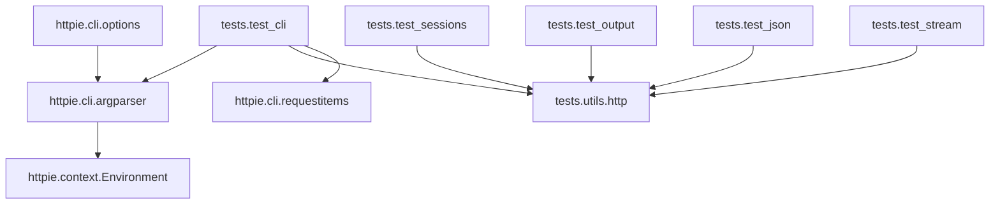

# RepoSleuth 报告 · cli

## 综合评分

- 架构（Cartographer）：**7/10**
- 可读性（Reader）：**7/10**
- 安全（Auditor）：**7/10**

## 架构图

## 新人上手路线

1. 阅读文档
2. 追踪主流程
3. 理解命名规范
4. 查看注释文档
5. 运行示例代码

## 风险清单

- [ ] tests/test_auth_plugins.py:12 硬编码凭据
- [ ] httpie/cli/nested_json/parse.py 缺少输入验证
- [ ] httpie/cli/argparser.py 缺少参数类型检查
- [ ] httpie/cli/argtypes.py 缺少参数值检查
- [ ] httpie/cli/argtypes.py 缺少参数值范围检查
- [ ] docs.contributors.fetch 模块间依赖复杂

## 附录 · 仓库画像

- 模块数：132；内部依赖边：592；外部依赖：20；总行数：18988
