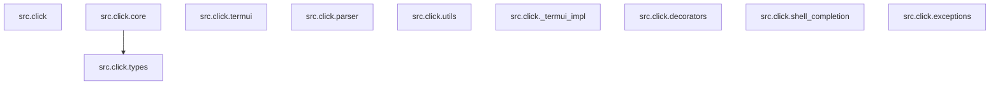

# RepoSleuth 报告 · click

## 综合评分

- 架构（Cartographer）：**8/10**
- 可读性（Reader）：**8/10**
- 安全（Auditor）：**8/10**

## 架构图

## 新人上手路线

1. 阅读文档
2. 运行示例
3. 理解模块结构
4. 编写测试用例
5. 调试代码

## 风险清单

- [ ] 命令行参数未验证
- [ ] 敏感信息输出日志
- [ ] 代码风格不一致
- [ ] 潜在安全漏洞
- [ ] 数据风险

## 附录 · 仓库画像

- 模块数：90；内部依赖边：196；外部依赖：7；总行数：29121
