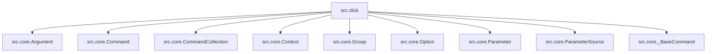

# RepoSleuth 报告 · click

## 综合评分

- 架构（Cartographer）：**8/10**
- 可读性（Reader）：**8/10**
- 安全（Auditor）：**8/10**

## 架构图

## 新人上手路线

1. 阅读README
2. 浏览src.click.core.py
3. 查看src.click.utils.py
4. 运行测试用例
5. 探索examples目录

## 风险清单

- [ ] src.click.core.py: 命令解析逻辑复杂
- [ ] src.click.core.py: 依赖外部库
- [ ] src.click.core.py: 数据泄露风险
- [ ] src.click.core.py: 安全漏洞
- [ ] src.click.core.py: 代码风格统一
- [ ] src.click.core.py: 依赖管理规范

## 附录 · 仓库画像

- 模块数：90；内部依赖边：196；外部依赖：7；总行数：29121
